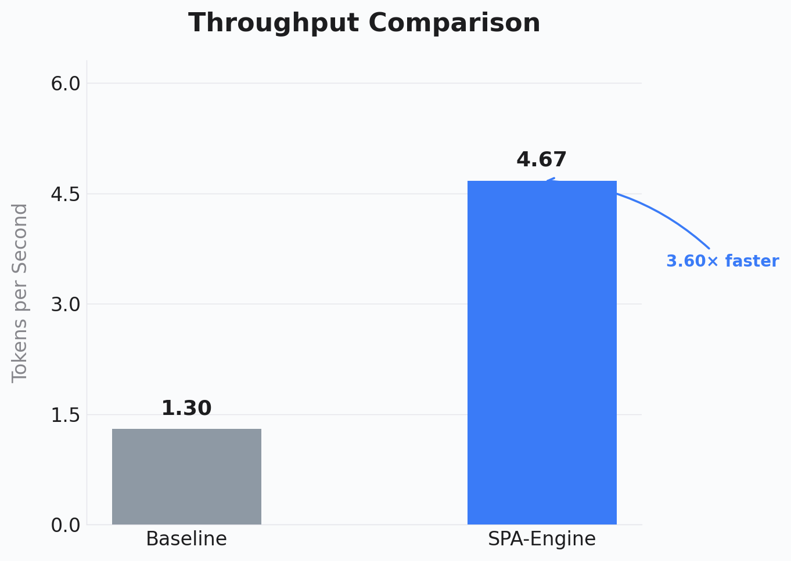
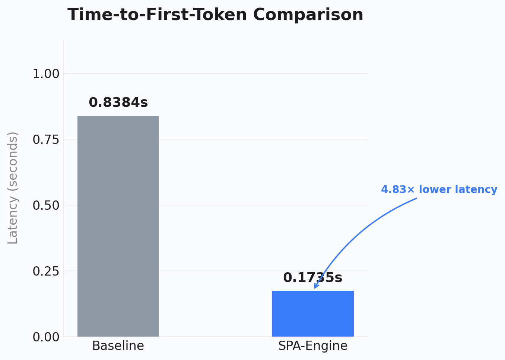

<div align="center">
  <h1>Tiesta: Your AI Engineering Companion</h1>
  <p><strong>A fully autonomous, 100% local, VRAM-efficient AI agent powered by Ollama.</strong></p>

  [](https://pypi.org/project/tiesta/)
  [](https://pypi.org/project/tiesta/)
  [](https://opensource.org/licenses/MIT)

</div>

---

Tiesta is not just an agent; it's your second engineer. It goes beyond simple autocomplete or conversational chatbots. Tiesta is a true companion who actively explores your codebase, autonomously executes terminal commands, resolves compilation errors, and, when finished, politely asks: *"I've finished my part, what's next?"*

Designed from the ground up to run entirely locally, Tiesta empowers developers to build, refactor, and debug complex applications with zero data privacy concerns and absolute flexibility.

---

## 🎉 What's New in v0.2.0
* **🚀 SPA-Engine (Turbo Mode):** Tiesta now features a massive hardware-accelerated Turbo Mode! By utilizing a custom Speculative Paging Architecture (SPA), Tiesta achieves lightning-fast generation speeds on massive 7B models using only 4GB VRAM. This AST-validated neural router intelligently bypasses I/O bottlenecks with Cross-Platform (POSIX/Win32) zero-copy memory mapping.
* **Autonomous Environment Management:** Tiesta now autonomously manages its own dependencies! If your local Ollama daemon is not running, Tiesta will seamlessly spin it up in the background (with full Windows compatibility) without crashing.
* **Network Patch:** Patched IPv6/DNS resolution errors on Windows by enforcing strict `127.0.0.1` IPv4 mapping.

---

## 📊 Performance & Benchmarks

Tiesta's SPA-Engine fundamentally alters the performance characteristics of local AI.

<div align="center">
  
  
</div>

* **Speed:** **3.60x Throughput Increase**.
* **Responsiveness:** **4.83x Lower Latency (TTFT)**.
* **Efficiency:** Saves ~146 GB of SSD Hardware I/O during complex codebase generations.

---

## 🌟 Features

* **100% Local & Private:** No external API calls. Your code never leaves your machine. Powered natively by Ollama.
* **Bring Your Own Model (BYOM):** During onboarding, dynamically discover and select any Ollama model installed on your system. Highly optimized for `qwen2.5-coder:7b` for ultra-fast, low-VRAM execution.
* **Hardware-in-the-Loop:** A killer feature for embedded systems. Tiesta can autonomously scan active serial ports and read hardware logs (ESP32, ROS 2, Arduino) to instantly debug your hardware and patch the corresponding Python/C++ code.
* **Unified Permission Control Plane:** An elegant `Rich`-powered UI intercepts and gates destructive terminal commands (`rm`, massive code deletions), ensuring absolute human oversight before modifying your system.
* **Polyglot Linter:** Validates syntax proactively. If Tiesta makes a syntax error in Python, JavaScript, C++, Rust, or Dart, it will instantly catch the traceback and self-correct without bothering you.
* **Dynamic Architecture Maps:** Automatically generates and updates Mermaid.js visual maps (`TIESTA_ARCHITECTURE.md`), allowing the agent to *see* your project structurally while providing human-readable documentation.
* **Zero-Dependency Semantic RAG:** Instead of relying on heavy `tree-sitter` C-bindings, Tiesta uses a highly efficient, regex-powered semantic chunking system to precisely locate symbols, classes, and variables.
* **LSP Integration:** Built on `jedi`, it understands your code context natively (go to definition, find usages) without spinning up a heavy background language server.

---

## 🚀 Getting Started

### Prerequisites

1. Install [Ollama](https://ollama.com/) and ensure the daemon is running.
2. Pull the recommended default model (or any model of your choice):
   ```bash
   ollama pull qwen2.5-coder:7b
   ```

### Installation

Install Tiesta globally via PyPI:
```bash
pip install tiesta
```

### Quickstart

Run Tiesta interactively in your current project directory:
```bash
tiesta
```
Or unleash the SPA-Engine by passing the `--turbo` flag:
```bash
python3 -m tiesta.main --turbo
```
On the very first run, Tiesta's **Onboarding Wizard** will automatically launch to detect your installed Ollama models and set up your preferred environment.

You can also run one-shot tasks directly from the terminal:
```bash
tiesta "Refactor the user authentication logic in core/auth.py"
```

---

## 🧠 How it Works

Tiesta employs a sophisticated "Precision Coding Protocol" via a customized Agentic Execution Loop (The **Orchestrator**):

1. **Context Loading:** Tiesta silently loads a lightweight Zero-Shot workspace awareness map (directory trees, git statuses, architecture graphs).
2. **Decomposition:** It forces the underlying LLM to think step-by-step and enumerate a checklist of sub-tasks.
3. **Execution & Self-Correction:** Tiesta executes tools natively in a sandboxed environment. If a compilation error or git conflict occurs, the Orchestrator autonomously feeds the traceback back to the LLM to self-correct up to 3 times before asking for human help.
4. **Result Verification:** Before rendering the final response to the user, the agent cross-verifies its output against its internal checklist to guarantee completeness.

---

## 🔗 Links
- **Repository:** [Click here to view the repo](https://github.com/yakup-karatass/tiesta)
- **Issue Tracker:** [Report bugs/issues here](https://github.com/yakup-karatass/tiesta/issues)

---

<div align="center">
  <i>"Speed is secondary to correctness. Measure Twice, Cut Once."</i>
</div>
